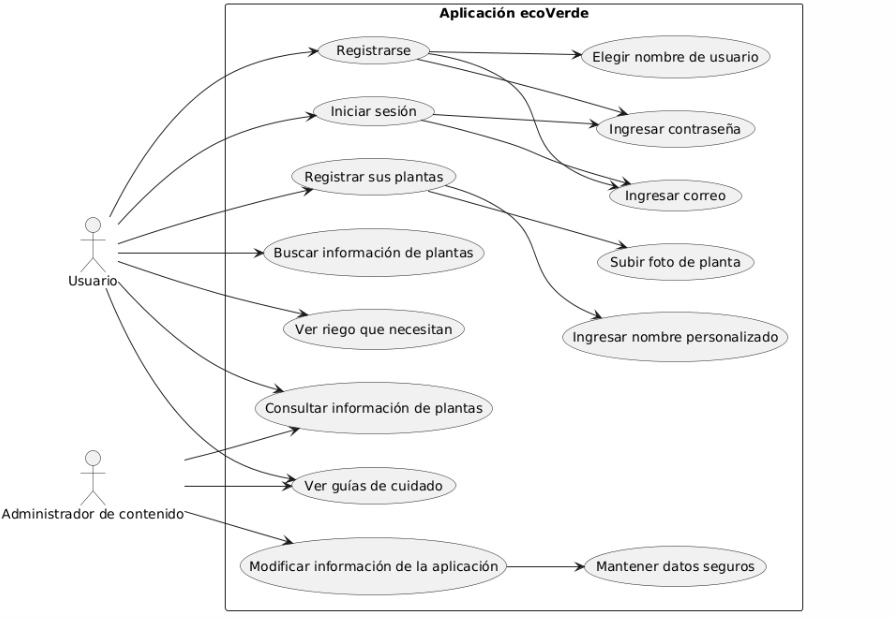

# Diagrama

# Listado final
## Nivel de cobertura: 100%
## Requisitos Funcionales:

### RF-1: Búsqueda de Plantas
Busqueda por:
  - Nombre científico
  - Nombres comunes
  - Filtros por tipo (interior/exterior, floral, frutal)

### RF-2: Fichas de Plantas
- Información estructurada:
  - Requerimientos de luz/agua (escala numérica 1-5)
  - Toxicidad para mascotas
  - Periodicidad de abonado
  - Sección "Problemas Comunes" con soluciones

### RF-3: Calendario de Cultivo
- Recordatorios programables (riego, poda)
- Registro fotográfico progresivo

### RF-4: Guías Interactivas
- Tutoriales con:
  - Diagramas animados
  - Listas de materiales

### RF-5: Sistema de Dificultad
- Escala de 3 niveles:
  - **Principiante** (ej: potos, suculentas)
  - **Intermedio** (ej: orquídeas, tomates)
  - **Avanzado** (ej: bonsáis, plantas carnívoras)

### RF-6: La aplicación debe permitir registrarse e iniciar sesión.

### RF-7: La aplicación debe tener una seccion con conocimiento local sobre las plantas

## Requisitos No Funcionales:
### RNF-1:
 La aplicación debe permitir que un usuario sin experiencia en jardinería pueda comprender la información de cuidado de las plantas con descripciones claras y ejemplos visuales.

### RNF-2:
 Los colores y fuentes utilizados en la interfaz deben garantizar un contraste adecuado para facilitar la lectura.

### RNF-3:
 La aplicación debe tener una interfaz intuitiva que permita a los usuarios acceder a la información de las plantas en no más de 5 interacciones desde la pantalla principal.

### RNF-4:
 Los botones y enlaces deben estar claramente visibles y colocados en posiciones intuitivas.

### RNF-5:
 Las acciones importantes como eliminar una calendario de crecimiento deben requerir confirmación del usuario para evitar pérdidas accidentales de información.

### RNF-6:
 Las imágenes utilizadas para ilustrar cuidados de plantas deben tener una resolución suficiente para que los detalles importantes.